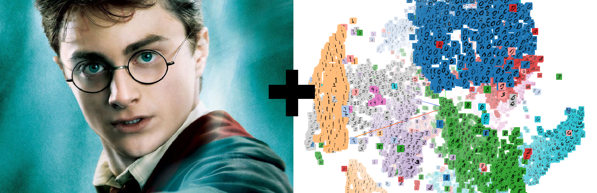

## Word Embeddings (parte 1)



### Descrição

Criação de um modelo de Word Embedding com base no conteúdo do livro do Harry Potter.

### Objetivo

Identificar similaridades e criar analogias. Exemplos:

* Conceitos mais similares ao nome 'harry':
    ```
        model.wv.most_similar('harry')
    ```
* Analogias: 'harry está para o herói da história assim como o vião está para ...'
    ```
        model.wv.most_similar(positive=["harry","vilain"],negative=["hero"])
    ```

### Método

A primeira tarefa consistia da criação do *corpus* para treinamento do modelo de Word Embedding. O modelo escolhido foi o **Word2vec**. Tendo em
conta que este modelo recebe como parâmetro uma **lista de lista de *tokens*** (lista de frases), foi feita uma "grosseira" aproximação onde cada linha do ficheiro do livro do Harry Potter representava uma **frase**.

Assim, utilizou-se o **Tokenize** da biblioteca gensim.utils para separação dos **tokens** de uma frase. **book_content** é, por tanto, o *corpus* para
treinamento do modelo. Por consequência, a variável *model* representa o modelo criado, sendo a partir dela que as funções de similaridades são invocadas.

Por fim, realizou-se o salvamento do modelo com o nome *model_harry*. Com o modelo salvo podemos ainda realizar o seguinte comando no terminal:

```
$ python -m gensim.scripts.word2vec2tensor -i model_harry -o model_harry
```

Tal comando gera dois novos ficheiros: *model_harry_tensor* e *model_harry_metadata*. Com estes ficheiros podemos através do [Tensor Flow](https://projector.tensorflow.org/) visualizar tridimensionalmente o modelo criado (podendo assim ver claramente as distâncias dos vetores das palavras 
no espaço vectorial).

### Ficheiros

* **livro.txt**: livro do Harry Potter
* **gensim_test.py**: cria o modelo de Word Embedding com base no livro do Harry Potter e salva-o com o nome *model_harry*

### Depêndencias

* gensim