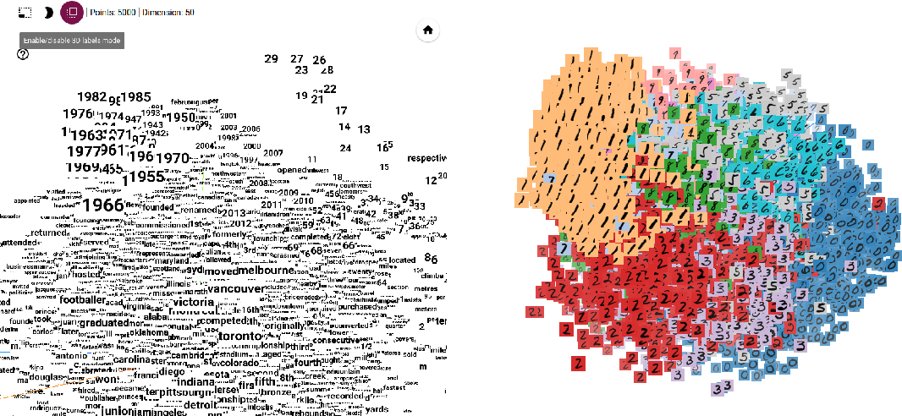

## Word Embeddings (parte 2)



### Descrição

Criação de dois programas: um que cria um **Word Embedding** a partir de um corpus genérico de entrada e outro que seja capaz de gerar analogias sobre ele.

### Método

Quanto a criação do *corpus* para treinamento do modelo, novamente recorreu-se a uma estratégia "grosseira" de considerar como **frase** cada linha dos ficheiros de texto. A diferença é que neste trabalho aceita-se um diretório contendo diversos arquivos de texto para formação do *corpus* (e não apenas um ficheiro como no trabalho anterior).

Quanto a criação das analogias, cada linha do ficheiro de analogias deve ter três palavras. Para via de exemplo, as analogias criadas serão da seguinte forma:

 * analogias.txt:
 ```
    Messi Lebron Futebol
 ```
 Analogia criada: *"Messi está para o Futebol assim como o Lebron está para o ..."*

### Ficheiros

* **cria_modelo.py**: programa que, dado os parâmetros para o modelo de Word Embedding **Word2Vec** e o *path* para uma pasta com o nome dos textos para criação do *corpus*, cria e salva o modelo segundo os parâmetros estabelecidos. Deste modo, são passados como argumentos ao programa os seguintes parâmetros:

    * *dir*: *path* para o diretório contendo os arquivos de texto para criação do *corpus*;
    * *-e* (*--epochs*): número de *epochs* para treinamento do modelo (*default=5*);
    * *-d* (*--dim*): número de dimensões para os vetores representativos das palavras para o modelo (*default*=100);
    * *-o* (*--out*): *paht* para o diretório de *output* em que o mdelo será salvo (*default=diretório atual*)

* **cria_analogias.py**: programa que, dado um ficheiro contendo três palavras por linha e um modelo Word2vec, cria uma analogia para estas palavras (para cada linha). Deste modo, são passados como argumento ao programa:

    * *model*: *path* para o modelo Word2Vec;
    * *-a* (*--analogias*): *path* para o ficheiro com as palavras para realizar as analogias.

### Dependências

* gensim

### Trabalho futuro

* Incorporar o Spacy para a separação correcta de **sentenças** durante a criação do *corpus*. 
